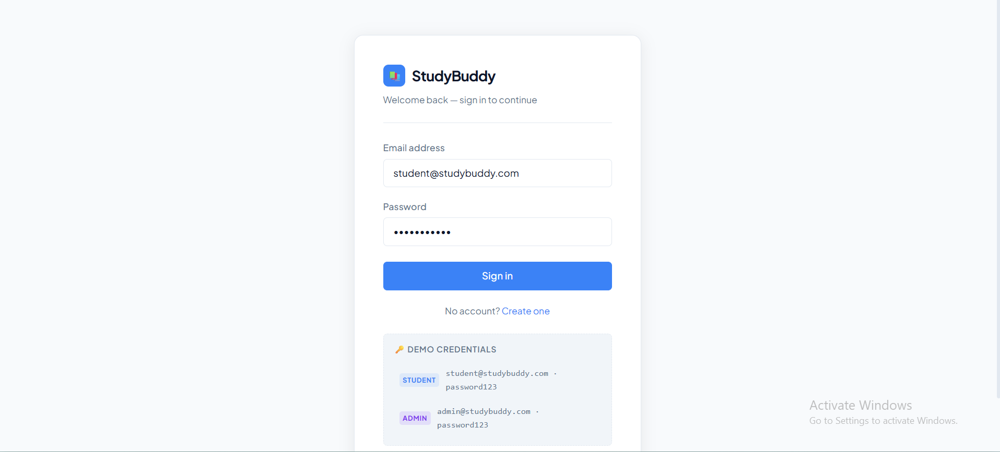
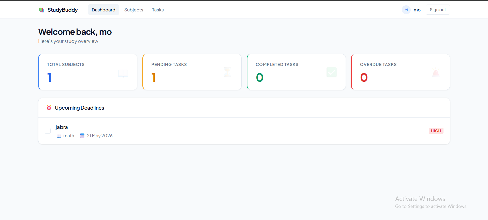
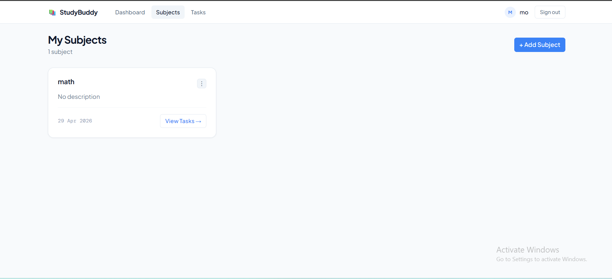
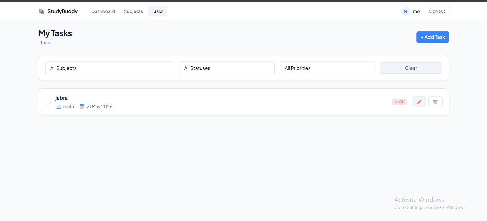

# StudyBuddy

A full-stack personal study planner where students can organize their courses as **subjects** and break them down into **tasks** with deadlines and priorities. Built end-to-end: REST API, SPA frontend, containerized database, and JWT-based authentication with role separation between students and admins.

Built as a solo project for the *Web Development 2* course at Inholland — but the architecture (controller → service → repository, with interfaces) is the same pattern I'd use on a production team.

## Screenshots

### Login


### Dashboard


### Subjects


### Tasks

## Tech stack

**Backend**
- PHP 8.2 on Apache
- Custom router with PSR-4 autoloading (no framework)
- PDO for database access
- `firebase/php-jwt` for token authentication
- Composer for dependency management

**Frontend**
- Vue 3 with the Composition API
- Vite as the build tool
- Pinia for state management
- Vue Router with navigation guards
- Axios with a JWT interceptor
- Bootstrap 5 for responsive layout

**Infrastructure**
- Docker Compose orchestrating four services: backend (Apache + PHP), MySQL 8, phpMyAdmin, and the Vite dev server
- MySQL schema and seed data run automatically on first boot

## Architecture

The backend follows a **clean three-layer separation** that's easy to test and reason about:

```
HTTP request
   ↓
Router  →  Middleware (JWT auth, role check)
   ↓
Controller   ← receives request, returns JSON response
   ↓
Service      ← business logic, validation rules
   ↓
Repository   ← all SQL queries live here, behind an interface
   ↓
Database (MySQL via PDO)
```

Each repository implements an interface (`UserRepositoryInterface`, `SubjectRepositoryInterface`, `TaskRepositoryInterface`), which means services depend on contracts rather than concrete database code. This was a deliberate choice — it makes the codebase ready for unit testing with mocked repositories, even though I haven't added the test suite yet.

## Features

- **Authentication** — register, log in, JWT token issued by the backend and stored client-side
- **Role-based authorization** — middleware checks the JWT role claim; the `/api/admin/users` endpoint returns `403` for student tokens
- **Subjects** — full CRUD, scoped to the logged-in user (students only see their own data)
- **Tasks** — full CRUD, with deadline, priority (low/medium/high), and status (pending/completed)
- **Filtering** — tasks can be filtered by subject, status, and priority via query parameters
- **Pagination** — all list endpoints support pagination
- **Cascading deletes** — deleting a user removes their subjects; deleting a subject removes its tasks (enforced at the database level via foreign keys)

## Running locally

You only need [Docker Desktop](https://www.docker.com/products/docker-desktop/).

```bash
git clone https://github.com/Abdullah24-it/studybuddy.git
cd studybuddy
docker compose up --build
```

First run takes a couple of minutes (downloads images, runs `composer install` and `npm install`). After that:

| Service     | URL                          |
|-------------|------------------------------|
| Frontend    | http://localhost:5173        |
| Backend API | http://localhost:8000/api    |
| phpMyAdmin  | http://localhost:8080        |

### Demo accounts (seeded automatically)

| Role    | Email                    | Password      |
|---------|--------------------------|---------------|
| Student | `student@studybuddy.com` | `password123` |
| Admin   | `admin@studybuddy.com`   | `password123` |

To stop without losing data: `docker compose stop`.

## Project structure

```
studybuddy/
├── backend/                  # PHP REST API
│   └── src/
│       ├── Controllers/      # Handle HTTP, return JSON
│       ├── Services/         # Business logic and validation
│       ├── Repositories/     # All SQL queries
│       ├── Interfaces/       # Repository contracts
│       ├── Models/           # User, Subject, Task entities
│       ├── Middleware/       # JWT auth + role check
│       ├── Database.php      # PDO singleton
│       └── Router.php        # Request dispatching
├── frontend/                 # Vue 3 SPA
│   └── src/
│       ├── components/       # NavBar, SubjectCard, TaskItem
│       ├── views/            # Dashboard, Subjects, Tasks, Login, Register
│       ├── stores/           # Pinia
│       ├── router/           # Vue Router with guards
│       └── services/         # Axios with JWT interceptor
├── database/init.sql         # Schema + seed data
└── docker-compose.yml
```

## What I learned building this

- **Why interfaces matter even on a small project.** Splitting `Repository` from `RepositoryInterface` felt like overkill at first. Then I needed to change how user lookups worked, and only had to touch one file — the services kept compiling. That clicked the lesson.
- **JWT middleware is the layer everything else trusts.** Getting the role check wrong here would silently expose admin endpoints. I wrote this part last and most carefully.
- **Docker Compose for local dev is worth the upfront cost.** Once `docker compose up --build` works, anyone can run the project on any OS in under five minutes. That's a huge difference from "first install PHP, then MySQL, then..."
- **Vue's Composition API + Pinia is a much cleaner pairing than I expected** coming from an MVC backend mindset.

## What I'd improve next

- **Add a test suite.** The interface-based repository pattern was set up specifically to enable mocking — the tests just aren't written yet. PHPUnit for the services, Vitest for Vue components.
- **Refresh tokens.** Currently the JWT has a fixed lifetime; users have to log in again when it expires. A refresh-token flow would be the right fix.
- **Input validation as a dedicated layer.** Right now validation lives inside services. Extracting it to dedicated request validator classes (like Laravel's Form Requests) would clean up the services.
- **API documentation.** The endpoints exist but aren't documented. Adding OpenAPI/Swagger would make this much friendlier to anyone trying to integrate.

## A note on AI assistance

I used Claude during development for debugging and for sanity-checking architectural decisions — most notably while implementing the role-based authorization middleware and the admin endpoint. Every line was reviewed and understood before being committed; I can walk through any part of this codebase and explain the choices.